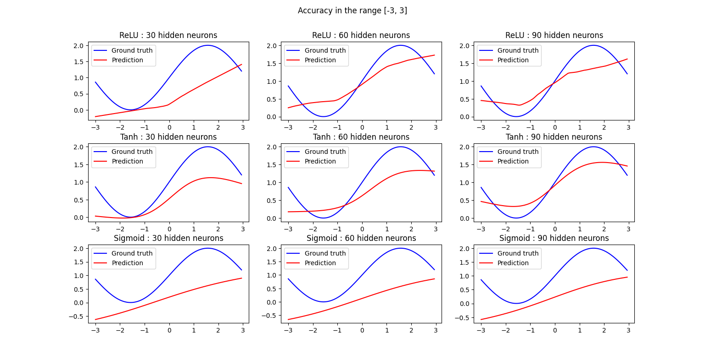

 <p style="text-align:left;">
  <font size = "+3"> <b>TD 1</b> </font> 
  <span style="float:right;"> 
   <font size = "+3"> MAGNIEZ - BLUM </font> 
  </span> 
</p> 


Pour ce TD, nous avons choisi d'évaluer l'influence de choix d'architectures et d'hyper-paramètres sur les performances dans un problème de régression. Les fonctions approximées sont des combinaisons linéaires de cosinus, de phase et de periodes diverses. L'échantillonage de valeurs fera partie de l'étude des performances, où l'on fera varier le bruit et la distribution.

Sauf précision, lorsqu'un paramètre changera les autres resteront constants. On utilisera un réseau feed-forward fully-connected tout au long des experiences. Les neurones seront de type $f(b + Σw*a)$, et $f$ est identique dans tout les neurones d'une même couche.

## I - Activations classiques

Dans cette partie, les fonctions d'activation f des neurones seront des fonctions "classiques": TanH, sigmoïde, ReLu.

La fonction approximée dans cette partie est :
$$
\begin{align*}
  G \colon\ &\mathbb{R}^{2} \to \mathbb{R} \\
  &(x, y) \mapsto \cos{(x) + \sin({y})}
\end{align*}
$$

A cause des valeurs que prend G, sigmoide et TanH sont plutot appropriées. Ce n'est pas le cas en général pour des régressions. Les mesures pour l'entrainement ne seront pas bruitées, et uniformes dans $ [-3, 3]^{2} $. 

Voici les résultats pour différentes tailles de couches cachées (une seule couche cachée). On constate que ReLU et TanH ont des résultats similaires, relativement médiocres. Peut-être que plusieurs couches cachées donneraient des meilleurs résultats, mais c'est beaucoup de paramètres pour une tâche d'apparence assez simple. Sigmoïde a des résultats bien inferieurs, ce qui est compréhensible en regardant les équations de la rétropropagation. 

Valeurs pour $\cos{(x)} + \sin{(x)}$, pour $x=0$ et y entre $-3$ et $3$ (comme dans le corpus d'entrainement):

# image #

Dynamiques de convergence:




# image #

## II - Activations sinusoïdales

Dans cette partie, on choisit la fonction d'activation sinus pour la couche de sortie. Elle n'est pas disponible par défault dans pytorch, il faut donc l'implémenter en sous-classant nn.Module. Sin est cependant présent dans la librairie (torch.sin), donc il n'est pas nécessaire de réimplémenter la propagation du gradient à travers l'activation.

```
class CustomSine(nn.Module):
    def forward(self, z):
        return torch.sin(z)
```

Voici les résultats obtenus, avec l'architecture suivante:
$$
2 
\begin{cases}
in \\
Identity
\end{cases}

\to
X
\begin{cases}
hidden \\
ReLu
\end{cases}
\to
1
\begin{cases}
out \\
Sin
\end{cases}
$$
  
Le réseau peut converger parfaitement à partir de X (nb de neurones cachés) = 2, mais le résultat dépendra de l'initialisation. Pour X=5, les résultats sont robustes. On pourrait utiliser un learning rate plus élevé pour une convergence plus rapide, mais c'était sans importance ici.

X=2, convergence:

X=2, exmple de mauvaise convergence:

X=5


## Conclusion 

On aurait pu mettre l' activation sinus en entrée, ou choisir une architecture différente. L'important ici est que selon le problème, avoir directement des activations appropriées peut apporter énormément aux performances d'un réseau. Par exemple, un réseau feedforward utilisé pour une tâche de reinforcement learning incluant des déplacements dans l'espace gagne beaucoup à implémenter des fonctions type cosinus, racine carrée, multiplication, division (ou passage à l'inverse). L'implémentation est cependant plus complexe, puisque l'entrée des neurones n'est plus nécessairement le produit matrice vecteur des poids par les activations.


